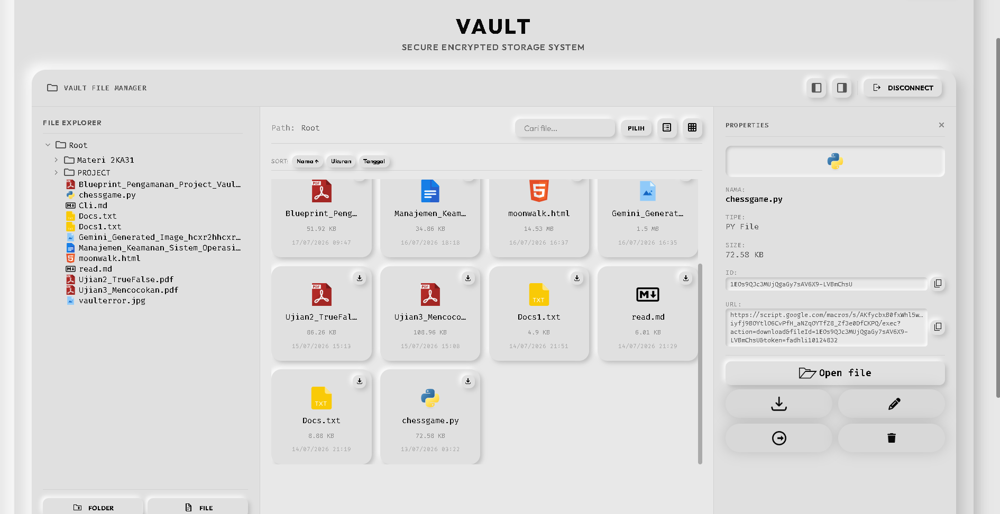
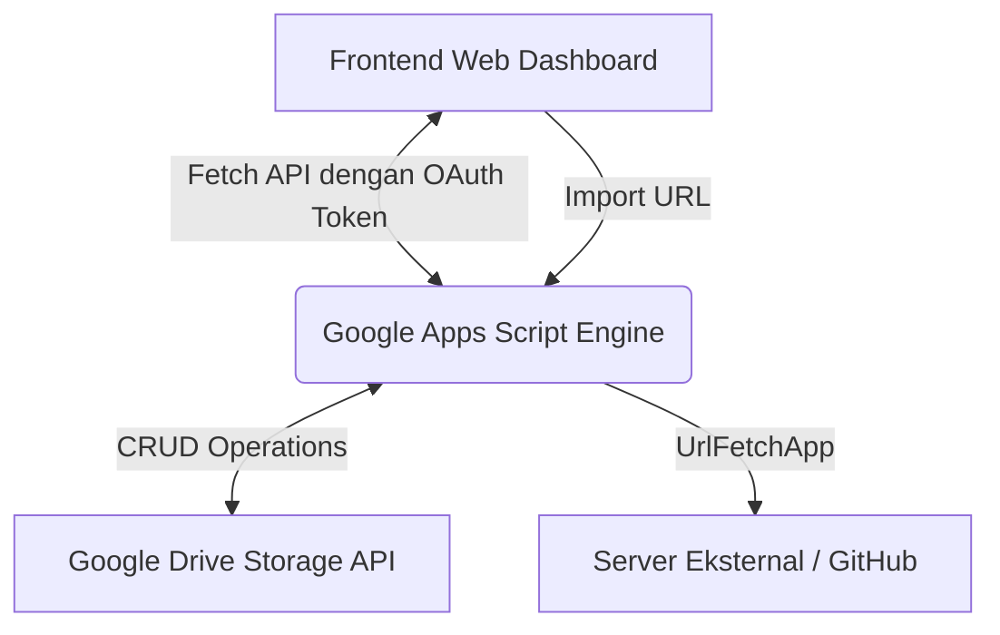

<p align="center">
  
</p>

# 🛡️ Cyber Vault — Secure Encrypted Storage System

<div align="center">
  
  
  
  
</div>

<p align="center" style="font-size: 1.15rem; font-weight: 500; color: #38bdf8;">
  Sistem manajemen berkas cloud terenkripsi, ringkas, dan modern yang didukung oleh Google Apps Script dan Google Drive API, lengkap dengan Editor Markdown terintegrasi dan terminal interaktif (Vault CLI).
</p>

---

## 🚀 Fitur Utama

### 1. 📂 Interactive File Explorer & Properties Sidebar

- **Mode Tampilan Fleksibel**: Beralih dengan mudah antara tampilan daftar (List View 📝) dan kisi (Grid View 📱).
- **Detail Metadata Samping (ℹ️ Item Properties)**: Panel detail interaktif yang memunculkan nama berkas, tipe, ukuran asli, ID unik Google Drive, serta Direct Download Link hanya dengan sekali klik.
- **Pintasan Aksi Cepat**: Lakukan pencarian, penggantian nama (_Rename_), perpindahan (_Move_), dan penghancuran (_Delete_ 🗑️) secara massal langsung dari antarmuka web.

### 2. 📝 Inline Text Editor

- **Pembuatan File Manual**: Buat dokumen teks baru langsung di cloud dengan format `.txt`, `.md`, dll.
- **Dua Mode Kerja**: Mode Baca (Read-only Preview) untuk keamanan dan kenyamanan membaca, serta Mode Edit untuk modifikasi langsung.

### 3. ⚡ Web-based Vault CLI (Terminal Emulator)

- Mengontrol seluruh brankas langsung via perintah teks layaknya menggunakan terminal lokal Linux/Termux.
- Dukungan perintah lengkap:
  - `ls` — Melihat daftar file/folder di direktori saat ini.
  - `cd [folder-id]` — Berpindah ke direktori sub-folder atau `cd ..` untuk kembali ke root.
  - `pwd` — Menampilkan path folder aktif.
  - `mkdir [nama]` — Membuat sub-folder baru.
  - `rm [id]` — Menghapus file atau folder.
  - `rename [id] [nama]` — Mengubah nama file/folder.
  - `mv [id] [id_tujuan]` — Memindahkan file/folder ke direktori lain.
  - `git status` & `git log` — Melihat status brankas serta riwayat berkas terbaru.
  - `curl -o [nama_file] [url]` — Mengimpor berkas langsung dari URL eksternal atau repository GitHub ke brankas cloud.

### 4. 📊 Real-time Progress Engine & Dashboard Logs

- **Visual Progress Bar**: Dilengkapi indikator progress bar bertema neon cyan-blue yang dinamis saat mengunggah banyak berkas secara massal (_bulk upload_) atau menghapus berkas.
- **Metrik Informasi**: Menampilkan status file ke-X dari total Y berkas, sisa persentase, dan perbandingan ukuran unggahan (e.g., `1.50 MB / 5.20 MB`).
- **Terminal Log Sync**: Menampilkan log konsol detail langsung ke CLI saat operasi cloud sedang berjalan.

### 5. ⚙️ Secure Access & Local Configuration

- **Masking Token**: Login aman menggunakan Access Token dengan perlindungan tombol _Show/Hide Password_ (`👁️` / `🔒`).
- **Local Setup**: Konfigurasi URL Google Apps Script disimpan secara aman di dalam LocalStorage browser pengguna (tidak diekspos ke source code).

---

## 🛠️ Alur Arsitektur



---

## 🔧 Panduan Instalasi & Deploy

### A. Konfigurasi Google Apps Script (Backend)

1. Buka [Google Drive](https://drive.google.com) Anda.
2. Buat folder baru di Drive bernama `Cyber Vault Data Store`.
3. Klik tombol **New** -> **More** -> **Google Apps Script** (atau kunjungi [script.google.com](https://script.google.com)).
4. Salin seluruh isi dari berkas [`code.gs`](./code.gs) ke editor Apps Script Anda.
5. Konfigurasikan hak akses dan konfigurasi awal (opsional) di script properties:
   - `HANDSHAKE_KEY` (Token login Anda, default: `default-cyber-secret-1337`).
6. Klik **Deploy** -> **New Deployment**.
   - Pilih type: **Web App**.
   - Execute as: **Me** (akun Google Anda).
   - Who has access: **Anyone** (dibutuhkan agar API dapat dihubungi secara anonim dari frontend via token handshake).
7. Salin URL Web App yang didapat (e.g., `https://script.google.com/macros/s/.../exec`).

### B. Jalankan Frontend Secara Lokal

1. Pastikan folder proyek ini telah diunduh di komputer Anda.
2. Jalankan static server lokal sederhana menggunakan Python atau Node.js:

   ```bash
   # Python 3
   python -m http.server 8000

   # Node.js (http-server)
   npx http-server -p 8000
   ```

3. Akses `http://localhost:8000` pada browser Anda.
4. Klik tombol **⚙️ Setup** di pojok kanan atas, tempelkan URL Web App Google Apps Script Anda, lalu simpan.
5. Masukkan Access Token (default: `default-cyber-secret-1337`) untuk membuka brankas!

---

## 📋 Penggunaan CLI Singkat

Berikut beberapa contoh perintah yang dapat Anda jalankan pada konsol terminal Cyber Vault di dashboard:

```bash
# 1. Menavigasi ke folder tertentu menggunakan ID
cd 1a2b3c4d5e6f7g8h9i0j...

# 2. Mengunduh file dari GitHub & menyimpannya secara otomatis ke cloud Drive
curl -o termux-app.zip https://github.com/Fadhlijeu/Termux-App

# 3. Membuat folder baru untuk mengelompokkan dokumen
mkdir Dokumen_Pribadi

# 4. Memindahkan file gambar ke folder baru
mv 1xyz987654321... Dokumen_Pribadi
```

---

## 🔒 Lisensi & Keamanan

Proyek ini didesain sebagai brankas pribadi. Seluruh proses pengunduhan, pemindahan, dan pemrosesan data dilakukan langsung di sisi server Google Apps Script pribadi milik pengguna, menjadikannya sangat aman dan bebas dari pelacakan pihak ketiga.

---

<div align="center">
  <sub>Brought to you with ⚡ by <strong>Antigravity AI</strong></sub>
</div>
